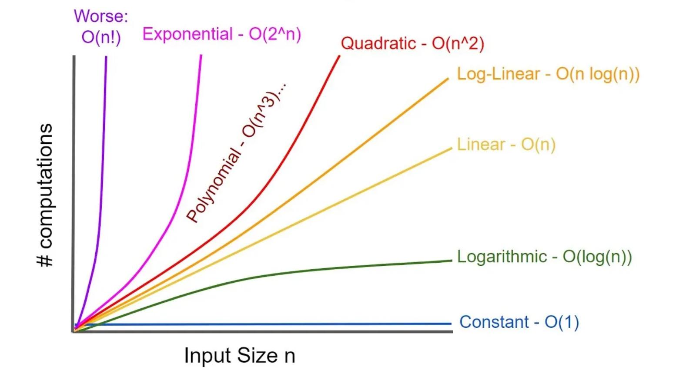
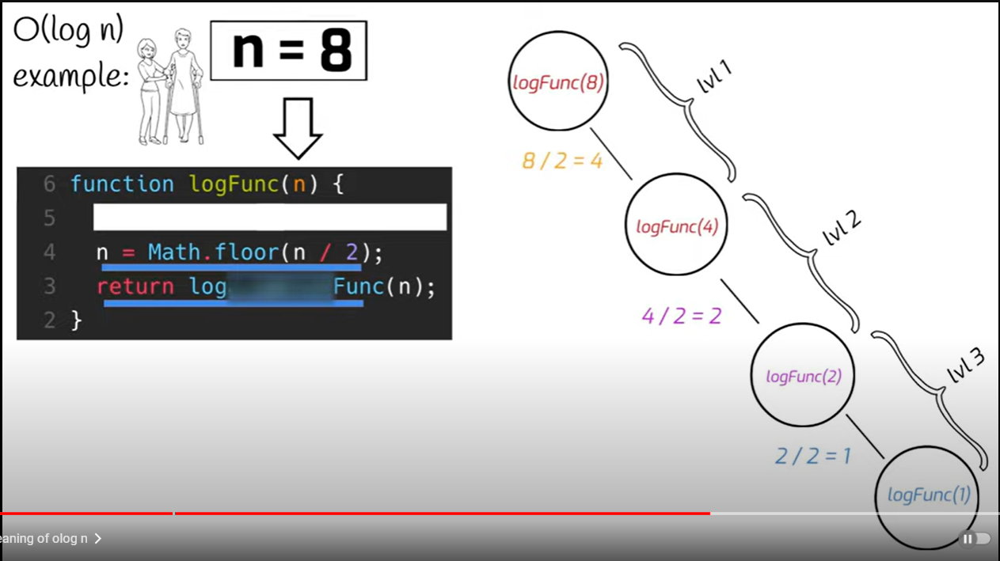

# Exercise 1

**O(n) - Linear Search**

### Description

Describe how Linear Search Algorithm iterates through the list to find an element.

Linear Search essentially goes through the entire list one by one until an element matches with what you're searching for and then it returns the address of the value. If no value is found , the search returns a NULL value.

```python
for index, value in enumerate([...]):  # O(n)
   if index == input: return index
```

> What are the main characteristics of the Linear Search Algorithm in terms of time complexity?

-  Time complexity is proportional to the space

> Discuss situations where Linear Search would be preferred over binary search.

-  binary has to be sorted, linear does not
-  linear is simple to implement
-  linear is faster on small data because it
   doesnt have to jump, slice and check

> How does the efficiency of Linear Search change with the size of the input list?

-  The more data, the longer it takes
-  The smaller the data, the quicker it takes

> Can you compare and contrast Linear Search with other search algorithms in terms of > time complexity and performance?

-  Linear Search's time complexity is just a straight line as the more items are added in the list, the less efficient it is.

-  Whereas in Binary Search the more items are added, the lesser time it might take to complete the search.

# Exercise 2

**O(log n) - Binary Search**

### Problem

Implement binary search to find an element in a sorted list

### Description

Your are devleoping a phonebook application that allows users to quickly search for contacts by their names. The list of contacts is sorted alphabetically by name. You need to implement a search algorithm that efficiently finds the index of a given contact name in then sorted list.

```cpp
int binarySearch(const std::vector<int>& arr, int target) {
    int left = 0; // O(1)
    int right = arr.size() - 1; // O(1)

    // Continue searching until the left pointer exceeds the right pointer
    while (left <= right) { // O(log n)
        // Calculate the middle index
        int mid = left + (right - left) / 2; // O(1)

        // Check if the middle element is the target
        if (arr[mid] == target) {
            return mid; // Target found, return its index - O(1)
        } else if (arr[mid] < target) {
            left = mid + 1; // Adjust left pointer to search in the right half - O(1)
        } else {
            right = mid - 1; // Adjust right pointer to search in the left half - O(1)
        }
    }

    return -1; // Target not found - O(1)
}
```

### Example Scenario

Suppose you're building a phonebook application for a large organization with thousands of employees. The phonebook contains contact information for employees sorted alphabetically by their names. When users search for a contact name, you want the application to quickly locate the contact's information. To achieve this, you decide to implement a binary search algorithm to efficiently search the sorted list of contacts.

### Questions

> Explain how the binary search algorithm works and why its efficient for searching in a sorted list




> What are the key steps involved in the binary search algorithm

```
check first
repeat this:
check middle if big or small
slice focus side of data
if found, stop
goto this
```

> How does the sorted nature of the list influence the efficiency of the binary search

-  there is intuition to skip index
-  the farther we go from the start, the more we know the
   larger the number

> Discuss scenarios where binary search would outperform linear search and vice versa

-  binary has to be sorted, linear does not
-  linear is simple to implement
-  linear is faster on small data because it
   doesnt have to jump, slice and check

> Can you analyze the time complexity of the binary search algorithm



# Exercise 3

**O(1) - Constant Time**

### Problem:

Implement a constant-time lookup in a dictionary-like data structure.
Description:

### Description

You are developing a caching system for a web application. The system needs to quickly retrieve
user information based on their unique user IDs. Each user ID is associated with various user data
such as name, email, and account type. You need to implement a data structure that allows
constant-time lookup of user information given their user ID.

> How does the constant-time lookup data structure improve the efficiency of the caching system?

Enhances efficiency by providing quick access to stored data without iterating through the entire cache.

Achieves O(1) time complexity for lookups.

> What are the key features and operations supported by the dictionary-like data structure?

-  Dictionary-like Structure: Stores key-value pairs.
-  Insertion: Add a key-value pair.
-  Lookup: Retrieve a value based on its key.
-  Deletion: Remove a key-value pair.

> Can you explain how the constant-time lookup operation is achieved in the data structure?

-  Utilizes hashing: The key is hashed to generate an index, providing direct access to the corresponding value.

> Discuss potential trade-offs or limitations of using a constant-time lookup data structure in the caching system.

-  Memory Usage: Hash collisions may lead to increased memory usage.
-  Hash Function Complexity: Designing an efficient hash function is crucial.
-  Not Ordered: Elements are not guaranteed to be in a specific order.

> How would you handle cases where the user ID is not found in the data structure?

-  Returns a special value (e.g., None in Python) or throws an exception to indicate that the user ID is not present.

```python
class ConstantTimeLookup:
    def __init__(self):
        self.data = {}

    def insert(self, key, value):
        self.data[key] = value

    def lookup(self, key):
        return self.data.get(key, None)

    def delete(self, key):
        if key in self.data:
            del self.data[key]
```

```python
# Usage
cache = ConstantTimeLookup()
cache.insert("user123", "John Doe")
cache.insert("user456", "Jane Smith")

user_id = "user123"
result = cache.lookup(user_id)
print(f"User ID {user_id} found with value: {result}" if result is not None else f"User ID {user_id} not found")
```
