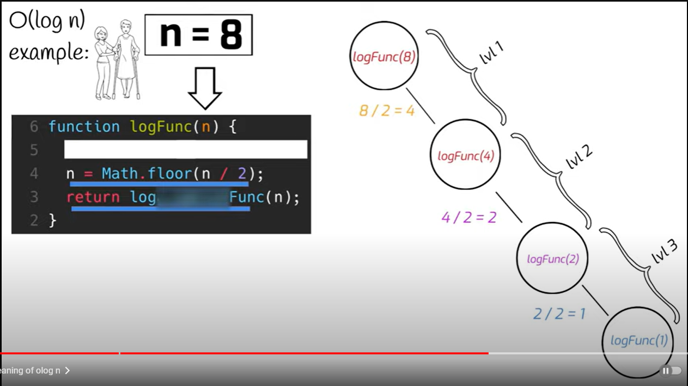

# Exercise 1

**O(n) - Linear Search**

### Description

Describe how Linear Search Algorithm iterates through the list to find an element.
Linear Search essentially goes through the entire list one by one until an element matches with what you're searching for and then it returns the address of the value. If no value is found , the search returns a NULL value.

> What are the main characteristics of the Linear Search Algorithm in terms of time complexity?

The main characteristic is that Linear Search runs linearly. Since it compares to a max of n items. Where n is the length of the list. This is why the computational complexity for linear search is O(n).

> Discuss situations where Linear Search would be preferred over binary search.

I can mainly think of situations where if the length of the list is way too long, then Linear Search might not be recommended. However Linear Search can be used in multidimensional arrays whereas Binary Search can only be used in single dimensional arrays. Linear Search also helps lessen the complexity of searching for an element and performs equality comparisons which is more focused on matching the value of the item compared to looking for its order which is done in Binary Search.

> How does the efficiency of Linear Search change with the size of the input list?

The efficiency will decrease the more items are inside the list. As i mentioned the computational complexity of Linear Search is O(n) where n represents the length of the list. And as the list grows bigger, the efficiency of the task linearly decreases.

> Can you compare and contrast Linear Search with other search algorithms in terms of > time complexity and performance?

Compared to Binary Search, Linear Search's time complexity is just a straight line as the more items are added in the list, the less efficient it is. Whereas in Binary Search the more items are added, the lesser time it might take to complete the search.
Write to Harvey Magarin

# Exercise 2

**O(log n) - Binary Search**

### Problem

Implement binary search to find an element in a sorted list

### Description

Your are devleoping a phonebook application that allows users to quickly search for contacts by their names. The list of contacts is sorted alphabetically by name. You need to implement a search algorithm that efficiently finds the index of a given contact name in then sorted list.

### Example Scenario

Suppose you're building a phonebook application for a large organization with thousands of employees. The phonebook contains contact information for employees sorted alphabetically by their names. When users search for a contact name, you want the application to quickly locate the contact's information. To achieve this, you decide to implement a binary search algorithm to efficiently search the sorted list of contacts.

### Questions

> Explain how the binary search algorithm works and why its efficient for searching in a sorted list


> What are the key steps involved in the binary search algorithm

```
check first
repeat this:
check middle if big or small
slice data
goto this
```


> How does the sorted nature of the list influence the efficiency of the binary search

-  there is intuition to skip index
-  the farther we go from the start, the more we know the
   larger the number

> Discuss scenarios where binary search would outperform linear search and vice versa

-  binary has to be sorted, linear does not
-  linear is simple to implement
-  linear is faster on small data because it
   doesnt have to jump, slice and check

> Can you analyze the time complexity of the binary search algorithm



# Exercise 3

**O(1) - Constant Time**
